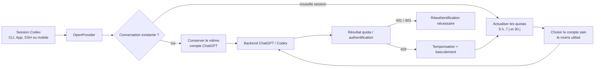

<h3 align="center">Rendez Codex ouvert !</h3>

<p align="center"><b>Proxy universel de fournisseurs pour OpenAI Codex, Claude Code, Claude Desktop et Grok Build</b><br>
Deux commandes suffisent pour utiliser n’importe quel LLM avec chacun de ces outils.</p>

<p align="center">
  <a href="https://x.com/claudeebum"></a>
  <a href="https://www.npmjs.com/package/@mdevs/openprovider"></a>
  <a href="https://github.com/mDevsLabs/OpenProvider/blob/main/LICENSE"></a>
  
</p>

```bash
npm install -g @mdevs/openprovider
opr start        # Proxy + tableau de bord sur localhost:10100
```

<table align="center">
  <tr>
    <td width="50%" align="center">
      <br>
      <sub><b>Claude Code avec n’importe quel modèle.</b><br>Le sélecteur reste celui de Claude Code, mais le modèle derrière peut changer.</sub>
    </td>
    <td width="50%" align="center">
      <br>
      <sub><b>Codex avec n’importe quel modèle.</b><br>Choisissez un fournisseur et commencez : même workflow, autre cerveau.</sub>
    </td>
  </tr>
  <tr>
    <td width="50%" align="center">
      <br>
      <sub><b>Claude Desktop avec n’importe quel modèle.</b><br>Opus répond, puis transmet la tâche à un sous-agent GPT-5.6 Sol.</sub>
    </td>
    <td width="50%" align="center">
      <br>
      <sub><b>Grok Build avec n’importe quel modèle.</b><br>Sol pilote la session et appelle un sous-agent Kimi K3.</sub>
    </td>
  </tr>
</table>

<p align="center">
  <a href="README.md">English</a> · <b>Français</b> · <a href="readme/README.ko.md">한국어</a> · <a href="readme/README.zh-CN.md">简体中文</a> · <a href="readme/README.ru.md">Русский</a> · <a href="readme/README.ja.md">日本語</a> · 📖 <a href="https://openprovider.me/"><b>Documentation complète →</b></a>
</p>

<p align="center">
  
</p>

Utilisez Claude, Gemini, Grok, GLM, DeepSeek, Kimi, Qwen, Ollama ou tout autre LLM avec Codex — ainsi qu’avec **Claude Code**, **Claude Desktop** et **Grok Build** — sans attendre l’ajout d’une intégration officielle.

Les sous-agents peuvent eux aussi fonctionner entre plusieurs fournisseurs. Claude Desktop peut répondre avec Opus, puis transmettre l’étape suivante à un sous-agent GPT-5.6 Sol. Grok Build peut piloter une session avec Sol tout en appelant Kimi K3, chaque outil conservant son interface native.

OpenProvider est un proxy local léger qui traduit l’API Responses de Codex vers le protocole utilisé par votre fournisseur. Streaming, appels d’outils, jetons de raisonnement et images : tout fonctionne dans les deux sens.

Il peut également gérer un **pool de comptes ChatGPT** pour l’authentification Codex. Ajoutez plusieurs comptes ChatGPT ou Codex, actualisez leurs quotas sur 5 heures, 7 jours ou 30 jours depuis le tableau de bord, puis laissez les nouvelles sessions être automatiquement dirigées vers le compte sain le moins utilisé.

Les conversations Codex existantes restent associées au compte qui les a démarrées. Les longues sessions SSH, tmux ou mobiles ne changent donc pas de compte en pleine conversation.

```text
Codex CLI / App / SDK ──/v1/responses──▶ OpenProvider ──▶ N’importe quel fournisseur
                                               │
               Anthropic · Google · xAI · Kimi · Ollama Cloud · Groq
               OpenRouter · Azure · DeepSeek · GLM · …et OpenAI lui-même
```



## Plateformes prises en charge

| Système | État | Gestionnaire de service |
|---|---|---|
| macOS arm64 / x64 | Entièrement pris en charge | launchd |
| Linux x64 / arm64 | Entièrement pris en charge | systemd, unité utilisateur |
| Windows x64 | Entièrement pris en charge | Planificateur de tâches ou service natif avec `--native` et WinSW |

Nécessite [Node.js](https://nodejs.org) 18 ou une version plus récente.

Le runtime Bun est automatiquement inclus pendant l’installation npm. Aucune installation séparée de Bun n’est nécessaire. Les trois plateformes fonctionnent nativement, sans WSL sous Windows.

## Démarrage rapide

```bash
# Installer OpenProvider.
# Le runtime Bun est automatiquement inclus.
# Seul Node.js 18 ou une version plus récente est requis.
npm install -g @mdevs/openprovider

# Lancer la configuration interactive.
opr init

# Démarrer le proxy.
opr start

# Installer le shim de démarrage automatique si nécessaire.
opr codex-shim install

# Utiliser Codex normalement.
codex "Écris un Hello World en Rust"
```

> [!TIP]
> Préférez une installation Node.js appartenant à votre utilisateur avec nvm ou fnm. Évitez si possible `sudo npm install -g`.

<details>
<summary><b>Erreur « bundled Bun runtime is missing » ou scripts Bun bloqués par npm</b></summary>

OpenProvider inclut Bun comme dépendance et l’exécute avec un lanceur Node.js. Vous n’avez donc pas besoin d’installer Bun manuellement.

Si l’erreur `bundled Bun runtime is missing` apparaît, l’installation a probablement ignoré les scripts de cycle de vie ou les dépendances optionnelles.

Réinstallez le paquet en autorisant le script d’installation de Bun :

```bash
npm install -g --allow-scripts=bun @mdevs/openprovider
```

N’utilisez pas `--ignore-scripts` ni `--omit=optional`.

Si l’installation d’origine utilisait `sudo` :

```bash
sudo npm install -g --allow-scripts=bun @mdevs/openprovider
```

Indiquez toujours explicitement `@mdevs/openprovider`. Une commande npm abrégée sans nom de paquet pourrait réinstaller le répertoire courant.

</details>

## Ajouter un fournisseur

Le moyen le plus rapide consiste à utiliser le tableau de bord web :

```bash
opr gui
```

Cette commande ouvre le tableau de bord à l’adresse suivante :

```text
http://localhost:10100
```

Depuis cette interface :

1. Cliquez sur **Ajouter un fournisseur**.
2. Choisissez parmi plus de **40 fournisseurs intégrés**, ou saisissez une URL personnalisée compatible avec OpenAI.
3. Collez votre clé API ou utilisez OAuth pour Anthropic, xAI et Kimi.
4. Les modèles sont automatiquement détectés depuis l’endpoint `/v1/models`.

Le nouveau fournisseur est immédiatement disponible, sans redémarrage.

Vous pouvez également ajouter un fournisseur avec :

```bash
opr init
```

La configuration peut aussi être modifiée directement dans :

```text
~/.openprovider/config.json
```

## Routage des modèles

Ciblez un fournisseur et un modèle avec la syntaxe suivante :

```text
fournisseur/modèle
```

Les fournisseurs dont les identifiants de modèles contiennent `/`, comme ZenMux, OpenRouter ou NVIDIA, sont présentés à Codex avec leurs barres obliques internes remplacées par des tirets.

Par exemple :

```text
zenmux/moonshotai/kimi-k3-free
```

devient :

```text
zenmux/moonshotai-kimi-k3-free
```

Le proxy restaure automatiquement l’identifiant natif. La forme originale reste également prise en charge.

```bash
# Utiliser Claude Opus avec Anthropic.
codex -m "anthropic/claude-opus-5" "Explique cette trace d’erreur"

# Utiliser Gemini avec Google.
codex -m "google/gemini-3-pro" "Écris des tests unitaires pour auth.ts"

# Utiliser GLM avec Ollama Cloud.
codex -m "ollama-cloud/glm-5.2" "Écris une migration SQL"

# Utiliser un modèle local avec Ollama.
codex -m "ollama/llama3" "Refactorise cette fonction"
```

Lorsque le préfixe `fournisseur/` est omis, OpenProvider utilise le fournisseur par défaut ou sélectionne automatiquement un fournisseur d’après le nom du modèle.

Exemples :

- `claude-*` est dirigé vers Anthropic ;
- `gpt-*` est dirigé vers OpenAI.

Les alias de combinaison sont des identifiants publics exacts. Ils peuvent être simples ou utiliser un espace de noms personnalisé.

Si un alias correspond exactement à un sélecteur `fournisseur/modèle` non-OpenAI déjà configuré, l’alias de combinaison est prioritaire pour le routage, `/v1/models` et le catalogue Codex. Renommer cet alias ou supprimer la combinaison restaure immédiatement le sélecteur physique du fournisseur.

Les modèles routés apparaissent également dans le sélecteur de modèles de l’application Codex, avec des niveaux de raisonnement propres à chaque modèle.

Les versions récentes de Codex peuvent proposer les niveaux suivants :

- `low`
- `medium`
- `high`
- `xhigh`
- `max`
- `ultra`

OpenProvider conserve `xhigh` et `max` comme niveaux distincts, sauf si la configuration du fournisseur associe explicitement l’un à l’autre.

Le niveau `ultra` sélectionne le raisonnement maximal et active la délégation proactive à plusieurs agents côté client. Il est converti en `max` avant l’envoi de la requête au fournisseur.

Les modèles routés n’annoncent `ultra` que si leur configuration l’autorise avec `reasoningEfforts`.

GPT-5.6 Sol, Terra et Luna sont préconfigurés comme entrées de catalogue :

- `gpt-5.6-sol`
- `gpt-5.6-terra`
- `gpt-5.6-luna`

OpenRouter utilise les identifiants `openai/...`.

Ces modèles restent soumis à leur disponibilité chez le fournisseur. OpenProvider prépare uniquement le routage et les métadonnées du catalogue.

<p align="center">
  
</p>

## Modes de compte du fournisseur OpenAI

| Identifiant | Route | Identifiants | Comportement |
|---|---|---|---|
| `openai` | Connexion Codex | Compte principal et comptes Codex ajoutés | Pool par défaut, mode direct optionnel |
| `openai-apikey` | API OpenAI | Clé API ou pool de clés | Aucun routage de comptes Codex |

- Le pool inclut la connexion Codex principale et les comptes ajoutés.
- Il prend en charge l’affinité, les quotas, la temporisation et le basculement.
- Le mode direct ignore le pool et utilise uniquement le jeton du compte courant.
- Les nouvelles installations utilisent le mode pool par défaut.
- Le mode peut être modifié depuis la page **Fournisseurs** du tableau de bord.
- Les identifiants des modèles restent simples dans les deux modes.
- L’ancien identifiant `chatgpt` est masqué après la migration.

Une sauvegarde de l’ancienne configuration est conservée dans :

```text
~/.openprovider/config.json.pre-openai-tiers-v2.bak
```

Pour la restaurer :

```bash
cp ~/.openprovider/config.json.pre-openai-tiers-v2.bak ~/.openprovider/config.json
```

Les configurations actuelles utilisent :

```json
{
  "openaiProviderTierVersion": 2
}
```

Les anciennes configurations v1 sont automatiquement migrées vers une entrée `openai` unique.

Le niveau API inclut les modèles virtuels Pro suivants :

- `gpt-5.6-sol-pro`
- `gpt-5.6-terra-pro`
- `gpt-5.6-luna-pro`

Chaque modèle Pro est remplacé au niveau du protocole par son modèle de base avec :

```json
{
  "reasoning": {
    "mode": "pro"
  }
}
```

Le catalogue contient huit identifiants :

- `gpt-5.5`
- `gpt-5.6`
- `gpt-5.6-sol`
- `gpt-5.6-terra`
- `gpt-5.6-luna`
- `gpt-5.6-sol-pro`
- `gpt-5.6-terra-pro`
- `gpt-5.6-luna-pro`

Il n’existe pas d’alias générique `gpt-5.6-pro`.

Les métadonnées officielles de l’API indiquent :

- 1 050 000 jetons de contexte ;
- 922 000 jetons maximum en entrée.

Pour utiliser le mode de compte `openai` :

```text
gpt-5.6-sol
```

Pour utiliser une clé API OpenAI :

```text
openai-apikey/gpt-5.6-sol
```

Les identifiants Codex et les clés API ne se remplacent jamais automatiquement.

### Comportement du pool de comptes

Ouvrez **Authentification Codex** dans le tableau de bord pour ajouter des comptes et sélectionner celui qui doit traiter la prochaine session.

OpenProvider applique les règles suivantes :

- **Les sessions existantes conservent leur affinité.** Une conversation reste associée au compte sélectionné.
- **Les nouvelles sessions peuvent être routées automatiquement.** OpenProvider compare les quotas sur 5 heures, 7 jours et 30 jours.
- **La récupération des quotas est intégrée.** Le tableau de bord peut actualiser tous les quotas en un clic.
- **Les journaux protègent les informations personnelles.** Les comptes sont représentés par des numéros anonymisés.
- **Les erreurs de jeton exigent une réauthentification.** Aucun autre identifiant n’est utilisé silencieusement.
- **Les réponses 429 déclenchent une temporisation.** Les tâches futures peuvent être redirigées vers un autre compte admissible.

## Points forts

- **Utilisez n’importe quel LLM avec Codex.**
- **Utilisez n’importe quel LLM avec Claude Code.**
- **Utilisez les modèles routés dans Claude Desktop et Grok Build.**
- **Utilisez les modèles avec GitHub Copilot App.**
- **Gérez plusieurs comptes ChatGPT en toute sécurité.**
- **Connectez-vous avec OAuth sans clé API pour xAI, Anthropic et Kimi.**
- **Utilisez OpenProvider avec Codex CLI, TUI, App et SDK.**
- **Conservez l’historique et les fournisseurs natifs des conversations.**
- **Configurez jusqu’à cinq modèles natifs ou routés comme sous-agents.**
- **Préparez les modèles GPT-5.6 Sol, Terra et Luna.**
- **Ajoutez la recherche web et l’analyse d’images aux modèles non-OpenAI.**
- **Générez et modifiez des images nativement.**
- **Consultez les requêtes et les erreurs dans le tableau de bord.**
- **Exécutez le proxy en arrière-plan comme service système.**
- **Arrêtez proprement le proxy et restaurez automatiquement Codex.**

Claude Code utilise l’API Anthropic Messages exposée par OpenProvider :

- `/v1/messages`
- `count_tokens`

Pour lancer Claude Code avec OpenProvider :

```bash
opr claude
```

Les modèles routés apparaissent dans le sélecteur `/model` avec des alias de la forme :

```text
claude-opr-<fournisseur>--<modèle>
```

Cette fonctionnalité nécessite Claude Code 2.1.129 ou une version plus récente.

Pour GitHub Copilot App, configurez l’URL suivante dans les fournisseurs de modèles :

```text
http://127.0.0.1:10100/v1
```

OpenProvider expose notamment :

```text
GET /v1/models
POST /v1/chat/completions
```

Consultez [`docs/github-copilot-app.md`](docs/github-copilot-app.md).

> [!WARNING]
> Lorsqu’un agent parent natif crée un enfant routé, le contenu de la tâche peut arriver chiffré par le backend et être perdu. Consultez [l’issue #92](https://github.com/mDevsLabs/OpenProvider/issues/92). Utilisez l’interface v1 pour une délégation inter-fournisseurs fiable.

## Fournisseurs et adaptateurs

| Fournisseur | Adaptateur | Authentification |
|---|---|---|
| OpenAI avec connexion ChatGPT | `openai-responses` | Transfert sans clé |
| OpenAI avec clé API | `openai-responses` | Clé |
| Umans AI Coding Plan | `anthropic` | Clé |
| Anthropic Claude | `anthropic` | OAuth ou clé |
| xAI Grok | `openai-chat` | OAuth ou clé |
| Kimi / Moonshot | `openai-chat` | OAuth ou clé |
| Google Gemini | `google` | Clé |
| Azure OpenAI | `azure-openai` | Clé |
| Cursor, expérimental | `cursor` | Tableau de bord ou configuration locale |
| Ollama Cloud | `openai-chat` | Clé |
| Ollama, vLLM ou LM Studio | `openai-chat` | Clé, généralement vide |
| Tout endpoint compatible OpenAI | `openai-chat` | Clé |

Sont également disponibles :

- DeepSeek
- Groq
- OpenRouter
- Together
- Fireworks
- Cerebras
- Mistral
- Hugging Face
- NVIDIA NIM
- MiniMax
- Qwen Cloud
- Tencent Cloud Coding Plan
- SiliconFlow

Consultez la liste complète avec :

```bash
opr init
```

ou dans la [documentation des fournisseurs](https://openprovider.me/reference/configuration/).

### Adaptateur Cursor expérimental

La prise en charge de Cursor est expérimentale. Elle apparaît dans `opr init` et dans le sélecteur **Ajouter un fournisseur** du tableau de bord.

Le transport HTTP/2 en direct est activé lorsqu’un jeton d’accès Cursor est configuré.

L’exécution native demandée par Cursor — lecture, écriture, suppression, `ls`, `grep`, shell ou récupération de ressources — est désactivée par défaut, car elle contourne les mécanismes d’approbation et de sandbox de Codex.

Un marqueur tel que `danger-full-access` dans une requête n’autorise jamais l’exécution locale native.

Pour autoriser explicitement l’exécution locale dans un environnement de confiance :

```json
{
  "nativeLocalExec": "on"
}
```

La valeur suivante reste acceptée pour compatibilité, mais se comporte comme `off` :

```json
{
  "nativeLocalExec": "codex-sandbox"
}
```

L’ancienne option suivante reste une activation explicite :

```json
{
  "unsafeAllowNativeLocalExec": true
}
```

MCP, l’enregistrement d’écran et le contrôle de l’ordinateur sont exposés par des hooks d’exécution. Sans exécuteur local, OpenProvider renvoie un résultat typé indiquant qu’aucun exécuteur n’est disponible.

## Interface en ligne de commande

```bash
opr init                       # Configuration interactive
opr start [--port 10100]       # Démarrer le proxy
opr stop                       # Arrêter le proxy et restaurer Codex
opr restore                    # Restaurer Codex sans arrêter le proxy
opr eject                      # Alias de `opr restore`
opr uninstall                  # Supprimer le service, le shim et la configuration
opr ensure                     # Démarrer si nécessaire et actualiser Codex
opr sync                       # Actualiser les modèles et réinjecter la configuration
opr codex-shim install         # Installer le shim de démarrage à la demande
opr codex-shim uninstall       # Désinstaller le shim
opr status                     # Vérifier l’état du proxy
opr login <fournisseur>        # Se connecter avec OAuth
opr logout <fournisseur>       # Supprimer une connexion enregistrée
opr account list               # Lister les comptes
opr account current            # Afficher le compte courant
opr account use                # Changer de compte
opr gui                        # Ouvrir le tableau de bord
opr claude [arguments...]      # Lancer Claude Code avec OpenProvider
opr claude desktop             # Enregistrer et appliquer le profil Claude Desktop
opr service install            # Installer le service
opr service start              # Démarrer le service
opr service stop               # Arrêter le service
opr service status             # Afficher l’état du service
opr service uninstall          # Désinstaller le service
opr update                     # Mettre à jour OpenProvider
opr update --tag preview       # Installer la version de prévisualisation
```

## Profil Claude Desktop

La vue **Claude → Desktop** du tableau de bord classe les routes dans quatre familles :

- `opus`
- `fable`
- `sonnet`
- `haiku`

Les nouvelles routes sont placées dans Opus. La première route Opus devient la valeur par défaut initiale.

Chaque famille non vide possède une route par défaut. Vous pouvez déplacer une route avec la souris, un écran tactile ou le clavier.

Le bouton **Enregistrer et appliquer** écrit le profil dans Claude Desktop.

L’import et l’export JSON permettent de sauvegarder le profil ou de le transférer vers une autre machine.

```bash
opr claude desktop apply
opr claude desktop show
opr claude desktop show --json
opr claude desktop move <route> <famille>
opr claude desktop move <route> <famille> --default
opr claude desktop default <famille> <route>
opr claude desktop default <famille> none
opr claude desktop export <chemin>
opr claude desktop export -
opr claude desktop import <chemin>
opr claude desktop import <chemin> --apply
```

Les routes non-Anthropic reçoivent des alias stables au format Claude avec une date synthétique en 2026. Cette date est un emplacement interne et non la date de sortie du modèle.

Les véritables routes Anthropic conservent leurs identifiants réels.

Utilisez `none` uniquement pour une famille vide. Une famille non vide doit toujours avoir une valeur par défaut.

Les anciennes commandes restent prises en charge :

```bash
opr claude desktop --static
opr claude desktop --hybrid
opr claude desktop --discovery-only
```

## Démarrage automatique : service ou shim

OpenProvider propose deux méthodes de démarrage automatique.

| | `opr service install` | `opr codex-shim install` |
|---|---|---|
| Fonctionnement | Gestionnaire de services du système | Encapsule les lanceurs de `codex` |
| Démarrage | Toujours actif après la connexion | Lors du lancement de `codex` |
| Redémarrage | Automatique après un plantage | Une fois par exécution de `codex` |
| Mises à jour de Codex | Sans impact | Le shim est réparé par la prochaine commande `opr` |
| Suppression | `opr service uninstall` | `opr codex-shim uninstall` |

Utilisez le **service** pour disposer d’un proxy toujours actif. Cette option est recommandée sur les machines de développement.

Utilisez le **shim** pour un démarrage léger à la demande, sans service permanent.

Le démarrage automatique par shim est activé par défaut et peut être désactivé dans le tableau de bord.

Si le port configuré est déjà utilisé, OpenProvider choisit automatiquement un autre port local libre et met à jour Codex.

Si une mise à jour de Codex remplace le shim, la prochaine commande `opr` sauvegarde le nouveau lanceur stable puis restaure le shim.

Pour désactiver cette restauration automatique dans la configuration :

```json
{
  "codexShimAutoRestore": false
}
```

Pour la désactiver avec une variable d’environnement :

```bash
export OPENCODEX_CODEX_SHIM_AUTO_RESTORE=0
```

## Désinstallation

Avant de supprimer le paquet npm, nettoyez l’état local :

```bash
opr uninstall
npm uninstall -g @mdevs/openprovider
```

La commande `opr uninstall` :

- arrête le proxy ;
- supprime les services installés ;
- supprime le shim Codex ;
- restaure la configuration native de Codex ;
- restaure le catalogue et l’historique ;
- supprime `~/.openprovider`.

## Configuration

La configuration se trouve dans :

```text
~/.openprovider/config.json
```

Si le fichier contient du JSON invalide, OpenProvider le sauvegarde sous la forme suivante :

```text
config.json.invalid-<horodatage>
```

Un avertissement est affiché et les valeurs par défaut sont utilisées. Le fichier original n’est jamais supprimé silencieusement.

Exemple de configuration avec plusieurs fournisseurs :

```json
{
  "port": 10100,
  "defaultProvider": "anthropic",
  "providers": {
    "anthropic": {
      "adapter": "anthropic",
      "baseUrl": "https://api.anthropic.com",
      "authMode": "oauth",
      "defaultModel": "claude-sonnet-4-6"
    },
    "ollama-cloud": {
      "adapter": "openai-chat",
      "baseUrl": "https://ollama.com/v1",
      "apiKey": "${OLLAMA_API_KEY}",
      "defaultModel": "glm-5.2"
    }
  }
}
```

Options importantes :

| Option | Description |
|---|---|
| `contextWindow` | Limite de contexte pour tout le fournisseur |
| `modelContextWindows` | Limites de contexte propres à chaque modèle |
| `modelInputModalities` | Types d’entrées acceptées, comme le texte ou les images |
| `modelSupportsReasoningSummaries` | Active ou désactive les résumés de raisonnement |
| `defaultMaxOutputTokens` | Budget de sortie par défaut |
| `modelMaxOutputTokens` | Budget de sortie propre à chaque modèle |

Une valeur `max_output_tokens` explicitement envoyée par le client reste prioritaire.

Les limites configurées peuvent réduire les métadonnées provenant de `/models`, mais ne peuvent jamais augmenter une fenêtre plus petite annoncée par le fournisseur.

Les métadonnées de secours de GPT-5.6 Sol, Terra et Luna utilisent une fenêtre de contexte de 1 050 000 jetons pour OpenAI avec clé API et OpenRouter. Elles ne contournent pas les restrictions d’accès du fournisseur.

> [!NOTE]
> Avec l’adaptateur `openai-chat`, `glm-5.2` et `glm-5.2[1m]` fonctionnent. OpenProvider retire le suffixe `[1m]` avant l’envoi, car certains endpoints compatibles OpenAI refusent cet identifiant.
>
> Pour utiliser la convention `[1m]` avec l’API Anthropic de Z.AI, configurez :
>
> `https://api.z.ai/api/coding/paas/v4`
>
> Définissez la fenêtre de contexte dans `modelContextWindows`, et non dans le nom du modèle.

### Modèles locaux

OpenProvider peut utiliser tout serveur local compatible avec OpenAI :

```json
{
  "port": 10100,
  "defaultProvider": "ollama",
  "providers": {
    "ollama": {
      "adapter": "openai-chat",
      "baseUrl": "http://localhost:11434/v1",
      "authMode": "key",
      "apiKey": "",
      "defaultModel": "llama3"
    },
    "vllm": {
      "adapter": "openai-chat",
      "baseUrl": "http://localhost:8000/v1",
      "authMode": "key",
      "apiKey": "",
      "defaultModel": "Qwen/Qwen3-32B"
    }
  }
}
```

Le transport WebSocket est désactivé par défaut.

Pour l’activer :

```json
{
  "websockets": true
}
```

Activez cette option uniquement si vous souhaitez que Codex utilise la route Responses WebSocket au lieu de HTTP/SSE.

## Accès distant

Par défaut, OpenProvider écoute uniquement sur :

```text
127.0.0.1
```

Aucune authentification supplémentaire n’est alors nécessaire.

Pour exposer le proxy sur le réseau local :

```json
{
  "hostname": "0.0.0.0"
}
```

Un jeton Bearer devient alors obligatoire pour protéger :

- `/api/*`
- `/v1/responses`
- `/v1/images/generations`
- `/v1/images/edits`

Définissez le jeton avant de démarrer OpenProvider :

```bash
export OPENCODEX_API_AUTH_TOKEN="votre-jeton-secret"
opr start
```

Le proxy refuse de démarrer sans cette variable lorsqu’il écoute sur une adresse autre que la boucle locale.

Pour installer un service avec accès réseau :

```bash
export OPENCODEX_API_AUTH_TOKEN="votre-jeton-secret"
opr service install
```

Les clients distants doivent inclure cet en-tête dans chaque requête :

```http
x-openprovider-api-key: votre-jeton-secret
```

Le jeton est comparé en temps constant afin de limiter les attaques temporelles.

OpenProvider adapte automatiquement l’historique de reprise de Codex pour conserver la visibilité des anciennes conversations.

Les métadonnées originales sont sauvegardées dans :

```text
~/.openprovider/codex-history-backup.json
```

Pour restaurer l’historique :

```bash
opr stop
```

ou :

```bash
opr restore
```

Si vous avez utilisé une ancienne version de développement sans sauvegarde d’historique :

```bash
opr recover-history --legacy-openai
```

Consultez la [référence de configuration](https://openprovider.me/reference/configuration/) pour la liste complète des options.

## Documentation

La documentation publique couvre :

- l’installation ;
- les fournisseurs ;
- le routage ;
- les modèles auxiliaires ;
- l’intégration Codex ;
- le sélecteur de modèles ;
- la CLI ;
- la configuration.

Elle est générée depuis [`docs-site/`](./docs-site) et publiée sur [openprovider.me](https://openprovider.me/).

Les notes des mainteneurs se trouvent dans [`structure/`](./structure).

Les anciennes investigations restent disponibles dans [`docs/`](./docs).

Les instructions destinées aux contributeurs se trouvent dans [`CONTRIBUTING.md`](./CONTRIBUTING.md).

La procédure de signalement des vulnérabilités se trouve dans [`SECURITY.md`](./SECURITY.md).

## Développement

Le développement depuis les sources nécessite que `bun` soit disponible dans votre `PATH`.

Cette installation est distincte du runtime Bun inclus dans le paquet npm, qui est uniquement utilisé par les commandes `opr` installées.

```bash
git clone https://github.com/mDevsLabs/OpenProvider.git
cd OpenProvider
bun install
bun run dev:proxy    # Démarrer l’API du proxy en mode développement
bun run dev:gui      # Démarrer le tableau de bord dans un autre terminal
bun x tsc --noEmit   # Vérifier les types TypeScript
```

La commande suivante reste un alias de `bun run dev:proxy` :

```bash
bun run dev
```

Dans un dépôt source, l’API expose :

- `/healthz`
- `/v1/responses`
- `POST /v1/images/generations`
- `POST /v1/images/edits`
- `/api/*`

La route `GET /` sert le tableau de bord uniquement après la génération de `gui/dist` :

```bash
bun run build:gui
```

Pendant le développement du tableau de bord :

```bash
bun run dev:gui
```

Consultez le guide [Contribuer](./CONTRIBUTING.md).

## Avertissement

OpenProvider est un projet indépendant maintenu par la communauté.

Il n’est **ni affilié à OpenAI, Anthropic ou un autre fournisseur, ni approuvé par eux**.

Certains fournisseurs, notamment Anthropic avec Claude, peuvent suspendre ou restreindre les comptes qui acheminent leur trafic API par des proxys tiers.

**Utilisez ce logiciel à vos propres risques.**

Avant de connecter un fournisseur, consultez ses conditions d’utilisation afin de vérifier que l’accès par proxy est autorisé.

Les mainteneurs d’OpenProvider ne peuvent pas être tenus responsables des mesures prises par les fournisseurs à l’encontre de votre compte.

## Licence

MIT